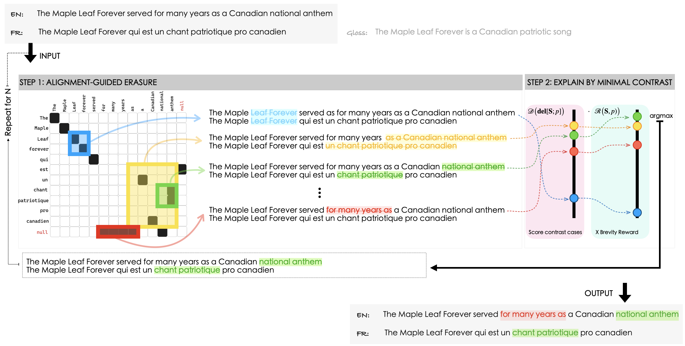

# Explaining with Contrastive Phrasal Highlighting: A Case Study in Assisting Humans to Detect Translation Differences

This repository contains code and data from the EMNLP 2023 paper that can be found [here]()!

This work shows that NLP predictions of models comparing two textual inputs, can be better explained by contrastive color-coded highlights that answer the question: *"What differences between the two inputs explain this prediction?"*. 
We introduce a technique to generate contrastive phrasal highlights via phrase-alignment-guided erasure and show, for the first time, that such highlights *help* bilingual humans when detecting meaning differences in human and machine translation texts.


## Table of contents

- [Setup](#setup)
- [Explaining with contrastive highlights](#explaining-with-contrastive-phrasal-highlighting-a-case-study-in-assisting-humans-to-detect-translation-differences)
- [Evaluating the usefulness of contrastive highlights with user studies](#user-studies)

## Setup

1. Create a dedicated virtual environment (here we use [anaconda](https://anaconda.org)) for the project & install requirements:

    ```
    conda create -n semdiv python=3.6
    conda activate semdiv
    conda install --file requirements.txt
    ```

2. Follow the setup instructions in [xling-SemDiv](https://github.com/Elbria/xling-SemDiv) download and install the required software: 

    ```bash
    bash setup.sh
    ```

## Explaining with contrastive highlights

<p align="center">
    
</p>

Explain the prediction of the divergent classifier R(S) by highlighting the phrasal pair (p) that, once erased, maximized the model's prediction R(DEL[S;p]) multiplied by brevity reward (BR(S,p)).
The algorithm takes as input tab-separated files containing the source and target texts along with their alignments (and optionally a sequence of pos-tags). For an example, of how you should format your input you can take a look at ``annotations/``. Once, you have your input ready, you can simply run: 
    
    ```bash
    cd explainers/contrastive_phrasal
    python main.py --paired_phrases --missing_phrases --reward --model_name_or_path ${model_name_or_path} --input ${input} --output ${output}
    ```    


## User Studies


## Citation

If you use any contents of this repository, please cite us.

```
@inproceedings{briakou-carpuat-2020-detecting,
    title = "Detecting Fine-Grained Cross-Lingual Semantic Divergences without Supervision by Learning to Rank",
    author = "Briakou, Eleftheria and Carpuat, Marine",
    booktitle = "Proceedings of the 2020 Conference on Empirical Methods in Natural Language Processing (EMNLP)",
    month = nov,
    year = "2020",
    address = "Online",
    publisher = "Association for Computational Linguistics",
    url = "https://www.aclweb.org/anthology/2020.emnlp-main.121",
    pages = "1563--1580",
}
```
